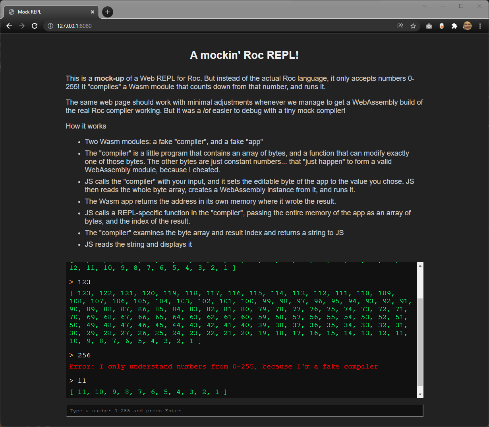

# A mockin' Roc REPL!

This is a mock-up Web REPL for a fake compiler. The only valid inputs are the numbers 0-255! It "compiles" a Wasm module that counts backwards from that number to 1.

The same web page should work with minimal adjustments whenever we manage to get a WebAssembly build of the Roc compiler working. But this way, I was able to build up the functionality more gradually.

How it works

- There are two Wasm modules: a "compiler", and an "app"
- The "compiler" is a little program that contains an array of bytes, and a function that can modify exactly one of those bytes. The other bytes are just constant numbers... that "just happen" to form a valid WebAssembly module (because I cheated).
- JS calls the "compiler" with your input, and overwrites one byte of the app with it. JS then reads the whole byte array, creates a WebAssembly instance from it, and runs it.
- The Wasm app returns the address in its own memory where it wrote the result.
- JS calls back into another function in the "compiler", passing the entire memory of the app as an array of bytes, and the index of the result in that array.
- The "compiler" then finds the array of numbers and stringifies it.
- JS reads the string and displays it

